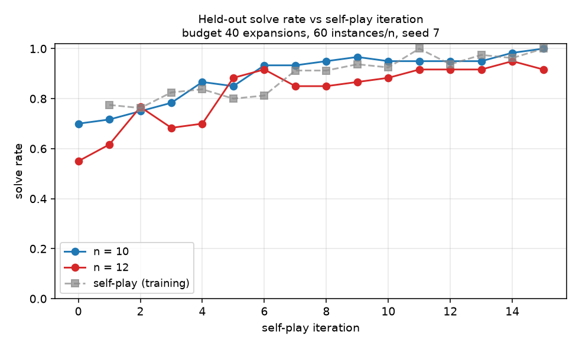
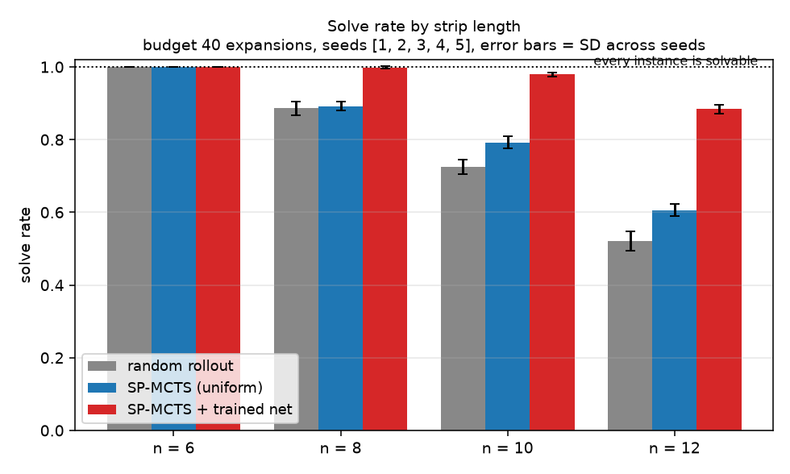

# M1.5 smoke test — results

<!-- Tables between GENERATED markers come from `python -m smoke_test.report`. -->

## Go / no-go

**GO — with the crux explicitly unresolved.** In a domain where the layer-ordering
constraint is real and exactly checkable, a learned policy plus single-player MCTS solves
materially more instances than plain MCTS at an identical fold budget: 0.884 vs 0.606 at
n = 12 and 0.979 vs 0.792 at n = 10 — gaps of about 14 and 10 pooled standard deviations —
while also using *fewer* expansions per solve (12.7 vs 20.2, 9.7 vs 16.4). Learning is
doing the work, not the extra machinery: running the *same* arm with random weights scores
0.587 and 0.787, statistically indistinguishable from the uniform baseline, so the gain
appears only after self-play. The held-out curve climbs from 0.55 to 0.92 at n = 12 over
fifteen self-play iterations on ~24 minutes of CPU. P1, P3 and P4 are met; **P2 is
not**, because at n = 6 and n = 8 the budget is generous enough that plain MCTS and random
restart both sit at or near the ceiling and cannot be separated — the search advantage
appears only once the instances get hard, at n = 10 and n = 12.

The honest qualifier is large and belongs in the same breath as the result. This
experiment did **not** solve the parent project's named blocker. In 1-D under simple
folds the layer order is a *total* order that the fold history determines outright, which
is what makes the legality check exact and cheap. In 2-D it is a partial order per overlap
region and deciding its consistency is where flat-foldability's NP-hardness lives. The
reduction kept the constraint *real* — it is what every arm is failing on — but it removed
precisely the part that is hard at Origamizer scale. What this result licenses is
continued investment in the single-player/SP-MCTS/self-play machinery, which works and is
not the risk. It does not license any belief that the 2-D layer-order representation is
in hand. That should be the next thing built, and it should be built before a network is
attached to it.

### Pass criteria

| | criterion | verdict |
|---|---|---|
| **P1** | environment correct | **MET** |
| **P2** | SP-MCTS beats random at every n, outside seed noise | **NOT MET** |
| **P3** | MCTS + net beats plain MCTS at n = 10 and n = 12 | **MET** |
| **P4** | learning curve monotone-ish, not flat and not noise | **MET** |

**P1 — MET.** Two independent implementations of the legality question agree on every
candidate transition reachable for n ≤ 7: a combinatorial rank-interval check
(`strip.check_no_crossing`) and a geometric one that renders the folded paper as a
polyline and runs all-pairs segment intersection (`verify.geometric_no_crossing`).
74,320 candidates, accepted and rejected alike, zero disagreements. Exhaustive search
through the transition function solves every brute-force-solvable instance at every n
tested — in fact every instance is solvable (560/560 across the test sets, state graph
fully enumerated with no cap hit), and every solution uses exactly n−1 folds as the action
model requires. 24 pytest cases pass, including a hand-worked illegal fold and a
hand-built interleaved-hairpin state that must be rejected, plus their legal nested
counterpart that must be accepted.

**P2 — NOT MET.** The criterion demands a margin outside seed noise at *every* n. At
n = 6 both arms solve 1.000 with zero variance; at n = 8 the gap is +0.006 against a
pooled SD of 0.022. Both are ceiling effects, not evidence against SP-MCTS: with 40
expansions and only 5 or 7 creases, random restart already finds a solution almost every
time, so there is nothing left to win. Where the instances are hard the criterion holds
comfortably — +0.067 (pooled SD 0.026) at n = 10 and +0.086 (0.031) at n = 12. Reported as
not met rather than re-scoped to "every n where the arms are separable", but the
substantive reading is that SP-MCTS beats random exactly where beating random is possible.
Note also that plain SP-MCTS spends *more* expansions per solve than random restart at
n = 10 and n = 12 (16.4 vs 15.3, 20.2 vs 18.5): it converts budget into solve rate, not
into cheaper solutions. Only the trained net does both.

**P3 — MET, on both of the offered criteria and at both lengths.** Solve rate: +0.187 at
n = 10 (pooled SD 0.018) and +0.278 at n = 12 (0.020). Expansions per solve: 9.7 vs 16.4
and 12.7 vs 20.2. Five seeds, per-seed values in the table below; the seed spread is small
enough that no seed of the net arm overlaps any seed of the uniform arm at either length.

**P4 — MET.** Held-out solve rate rises from 0.70 to 1.00 (n = 10) and 0.55 to 0.92
(n = 12) over fifteen iterations, with most of the gain by iteration 6 and a plateau after.
Not perfectly monotone — n = 12 dips at iterations 3–4 and again at 7–8 — but the trend is
far outside the run-to-run spread and training loss falls monotonically from 2.61 to 0.06.

---

## What was actually run

<!-- GENERATED:oracle -->
| n | test instances | solvable | min folds | mean reachable states | max |
|---|---|---|---|---|---|
| 6 | 32 | 32/32 (1.000) | 5 | 85 | 109 |
| 8 | 128 | 128/128 (1.000) | 7 | 386 | 555 |
| 10 | 200 | 200/200 (1.000) | 9 | 1780 | 2751 |
| 12 | 200 | 200/200 (1.000) | 11 | 7906 | 15047 |

Wall clock: 874s.
<!-- /GENERATED:oracle -->

<!-- GENERATED:arms -->
Budget 40 expansions per instance, seeds [1, 2, 3, 4, 5]. Solve rate is mean +/- SD across seeds; expansions/solve is the mean spend on instances that were solved.

| n | instances | arm | solve rate | per-seed | expansions / solve |
|---|---|---|---|---|---|
| 6 | 32 | random rollout | 1.000 +/- 0.000 | 1.000, 1.000, 1.000, 1.000, 1.000 | 7.4 |
| 6 | 32 | SP-MCTS (uniform) | 1.000 +/- 0.000 | 1.000, 1.000, 1.000, 1.000, 1.000 | 7.0 |
| 6 | 32 | SP-MCTS + trained net | 1.000 +/- 0.000 | 1.000, 1.000, 1.000, 1.000, 1.000 | 5.2 |
| 8 | 128 | random rollout | 0.886 +/- 0.019 | 0.867, 0.875, 0.906, 0.906, 0.875 | 12.0 |
| 8 | 128 | SP-MCTS (uniform) | 0.892 +/- 0.012 | 0.875, 0.891, 0.891, 0.906, 0.898 | 11.6 |
| 8 | 128 | SP-MCTS + trained net | 0.998 +/- 0.003 | 1.000, 1.000, 1.000, 1.000, 0.992 | 7.4 |
| 10 | 200 | random rollout | 0.725 +/- 0.020 | 0.755, 0.700, 0.730, 0.725, 0.715 | 15.3 |
| 10 | 200 | SP-MCTS (uniform) | 0.792 +/- 0.017 | 0.815, 0.800, 0.770, 0.785, 0.790 | 16.4 |
| 10 | 200 | SP-MCTS + trained net | 0.979 +/- 0.005 | 0.975, 0.985, 0.985, 0.975, 0.975 | 9.7 |
| 12 | 200 | random rollout | 0.520 +/- 0.027 | 0.525, 0.480, 0.535, 0.550, 0.510 | 18.5 |
| 12 | 200 | SP-MCTS (uniform) | 0.606 +/- 0.016 | 0.610, 0.580, 0.625, 0.610, 0.605 | 20.2 |
| 12 | 200 | SP-MCTS + trained net | 0.884 +/- 0.012 | 0.895, 0.865, 0.880, 0.890, 0.890 | 12.7 |

Wall clock: 135s total.
<!-- /GENERATED:arms -->

<!-- GENERATED:margin -->
| n | comparison | gap in solve rate | pooled SD | gap > SD? | expansions/solve |
|---|---|---|---|---|---|
| 6 | SP-MCTS (uniform) - random rollout | +0.000 | 0.000 | no | 7.0 vs 7.4 |
| 6 | SP-MCTS + trained net - SP-MCTS (uniform) | +0.000 | 0.000 | no | 5.2 vs 7.0 |
| 8 | SP-MCTS (uniform) - random rollout | +0.006 | 0.022 | no | 11.6 vs 12.0 |
| 8 | SP-MCTS + trained net - SP-MCTS (uniform) | +0.106 | 0.012 | yes | 7.4 vs 11.6 |
| 10 | SP-MCTS (uniform) - random rollout | +0.067 | 0.026 | yes | 16.4 vs 15.3 |
| 10 | SP-MCTS + trained net - SP-MCTS (uniform) | +0.187 | 0.018 | yes | 9.7 vs 16.4 |
| 12 | SP-MCTS (uniform) - random rollout | +0.086 | 0.031 | yes | 20.2 vs 18.5 |
| 12 | SP-MCTS + trained net - SP-MCTS (uniform) | +0.278 | 0.020 | yes | 12.7 vs 20.2 |
<!-- /GENERATED:margin -->

### Control: is it the learning, or just the extra machinery?

The net arm differs from the uniform arm in two ways at once — it has a network supplying
priors, and its leaf value blends a policy-guided rollout with the value head. Running the
identical arm with random weights (`torch.manual_seed(0)`, no training) separates those.
It lands on the uniform baseline at n = 10 and n = 12, so none of the gain comes from the
blending or the architecture; all of it arrives during self-play.

<!-- GENERATED:control -->
| n | SP-MCTS uniform | same net, random weights | trained net |
|---|---|---|---|
| 6 | 1.000 +/- 0.000 | 1.000 +/- 0.000 | 1.000 +/- 0.000 |
| 8 | 0.892 +/- 0.012 | 0.914 +/- 0.016 | 0.998 +/- 0.003 |
| 10 | 0.792 +/- 0.017 | 0.787 +/- 0.021 | 0.979 +/- 0.005 |
| 12 | 0.606 +/- 0.016 | 0.587 +/- 0.016 | 0.884 +/- 0.012 |
<!-- /GENERATED:control -->

### Learning curve

<!-- GENERATED:curve -->
Training args: `{'iterations': 15, 'episodes': 80, 'sims': 25, 'eval_budget': 40, 'eval_per_n': 60, 'seed': 7, 'window': 4}`.

| iteration | loss | self-play solve rate | held-out n=10 | held-out n=12 |
|---|---|---|---|---|
| 0 | - | - | 0.700 | 0.550 |
| 1 | 2.613 | 0.775 | 0.717 | 0.617 |
| 2 | 1.635 | 0.762 | 0.750 | 0.767 |
| 3 | 1.476 | 0.825 | 0.783 | 0.683 |
| 4 | 1.395 | 0.838 | 0.867 | 0.700 |
| 5 | 0.823 | 0.800 | 0.850 | 0.883 |
| 6 | 0.342 | 0.812 | 0.933 | 0.917 |
| 7 | 0.422 | 0.912 | 0.933 | 0.850 |
| 8 | 0.251 | 0.912 | 0.950 | 0.850 |
| 9 | 0.519 | 0.938 | 0.967 | 0.867 |
| 10 | 0.242 | 0.925 | 0.950 | 0.883 |
| 11 | 0.118 | 1.000 | 0.950 | 0.917 |
| 12 | 0.143 | 0.938 | 0.950 | 0.917 |
| 13 | 0.140 | 0.975 | 0.950 | 0.917 |
| 14 | 0.126 | 0.963 | 0.983 | 0.950 |
| 15 | 0.063 | 1.000 | 1.000 | 0.917 |

Wall clock: 1418s.
<!-- /GENERATED:curve -->

---

## Deviations from the task spec, and why

Stated up front rather than buried, because each one changes how a number should be read.

**1. Bundle files were not present in the environment.** The session's working directory
was a different repository (`saponin-generator`); `README.md`, `research/`,
`stage3_fold_sequence_rl/` and the rest were supplied as uploads and read in the order
the prompt specifies, but there was no repo to build inside. `smoke_test/` was therefore
built standalone, keeping the interface names the prompt lists: `Game` /
`getInitBoard` / `getNextState` / `getValidMoves` / `getGameEnded` /
`stringRepresentation`, `player` pinned to 1, `getCanonicalForm` the identity, and
`getGameEnded` returning a continuous score in [-1, 1] with 0.0 reserved for
"not terminal". No existing stage-3 stub was modified — there were none on disk to
modify.

**2. The held-out set cannot reach 200 instances at n = 6 or n = 8.** The entire space of
M/V assignments is `2^(n-1)`, i.e. 32 and 128 patterns. Rather than pad with duplicates
or shrink the test set to carve out a training split, those two lengths use their
*complete* pattern space as the test set and contribute nothing to training. The net is
trained on n = 10 and n = 12 only, which makes n = 6 and n = 8 out-of-distribution
generalisation tests and keeps train/test disjointness true by construction. n = 10 and
n = 12 do have 200 held-out instances each, disjoint from 312 and 400 training patterns.

**3. "Mean folds vs the brute-force optimum" is degenerate in this action model.** Each
action folds exactly one previously-unfolded crease, and an instance is solved when all
n−1 creases are folded, so *every* solution has exactly n−1 folds. The brute-force
oracle confirms this rather than assuming it (`min folds` column above). The metric
carries no information here and the sequence-length half of the M2 exit criterion cannot
be tested in this domain. Node expansions per solve is reported in its place, and is what
P3 is judged on alongside solve rate.

**4. Kawasaki and Maekawa are not exercised at all.** A 1-D strip has no interior
vertices, so neither theorem has anything to apply to. The prompt's two-tier reward
therefore collapsed to a single tier in this domain: the "expensive global check" (layer
crossing) is the only check, and it happens to be cheap. This is the part of the parent
design that this smoke test does *not* test — see the last section.

**5. The stretch target (single-vertex 2-D patterns) was not attempted.** The 1-D
deliverable took the budget. Nothing about the 2-D case is claimed here.

---

## Design notes worth carrying forward

**The action space collapses to `(crease, side)`.** A flap can fold over the top or under
the bottom, and those give genuinely different stackings — but the crease's M/V label
plus the current face orientation of the two adjacent segments pins the choice uniquely.
Derivation in `strip.py`'s module docstring. So the discrete action is exactly
(which crease, which side moves), `2(n−1)` actions, which is what the prompt specified;
the over/under degree of freedom is not a free parameter, it is determined.

**The layer order is a total order over panels, and the fold history forces it.** A panel
is a maximal run of segments whose connecting creases are still unfolded; it is straight,
so all its segments share a height. A simple fold lifts the moving flap over (or under)
the *entire* stationary stack and reverses the flap's internal order, because a 180°
rotation about the crease reflects x and z together. Nothing is chosen arbitrarily, so
the total order is not an over-constraining linearisation — it is the physics.

**Orientation and direction are the same number.** Because a fold reflects x and z
together, a segment's face-up flag and its forward direction along the paper flip at
exactly the same moments. Both start at +1, so one field serves both, which is what lets
a crease be placed on the correct side of a cell without extra bookkeeping.

---

## What would break at 2-D scale

The honest read on which parts of this generalise to Origamizer-sized patterns (hundreds
of faces) and which are artefacts of the 1-D reduction.

**Artefacts — these do not survive.**

- **The exact legality check is cheap only because the layer order is total and forced.**
  This is the big one. In 1-D under simple folds, the moving flap goes entirely above or
  below the stationary stack, so a fold implies its stacking with zero search. In 2-D the
  faces overlap in a planar arrangement and the layer order is a *partial* order per
  overlap region, subject to the taco-taco / taco-tortilla / tortilla-tortilla
  constraints; deciding whether a consistent assignment exists is exactly where the
  NP-hardness of flat-foldability lives (Bern & Hayes 1996). The check that this smoke
  test leans on throughout is the one thing that will not port. `M1`'s named blocker —
  how the layer ordering is represented and updated incrementally — is *not* answered by
  this result; it is sidestepped by the reduction.
- **The two-tier reward was never exercised.** With no interior vertices there is no
  cheap local filter, so the whole design of "prune in-rollout with local theorems,
  rescore at terminal" went untested. At 2-D scale that split is load-bearing, and this
  experiment says nothing about whether it works.
- **Episode length is fixed at n−1.** Real patterns need variable-length episodes and a
  meaningful notion of a shorter route. The step-budget and shortest-route parts of the
  reward design are untested.
- **Every instance is solvable.** The oracle found no unsolvable pattern at any n. In 2-D
  many crease patterns are not simple-foldable, so solve rate acquires an unknown
  denominator and a low score stops being interpretable. Here 100% is a known ceiling;
  there it will not be.
- **The MLP.** Padding per-segment features to a fixed `MAX_N` does not scale to hundreds
  of faces, and a strip's crease graph is a path, so nothing in this result speaks to
  whether a GNN over a real crease graph learns anything. (A GNN was deliberately not
  used here — torch-geometric would have been a heavyweight dependency for a path graph.)

**Likely to survive.**

- **The single-player framing and the de-adversarialised `Coach`.** No sign flips, no
  player alternation, continuous terminal score with 0.0 reserved as the non-terminal
  sentinel. This worked without friction and nothing about it is 1-D-specific.
- **SP-MCTS's max-in-subtree term.** The goal is one good sequence, not robust average
  play, and the max term is what keeps a mostly-failing branch alive. That argument is
  domain-independent.
- **`stringRepresentation` must include the layer stack.** Two states with the same
  folded silhouette and different stacking are different states. This is more true in 2-D,
  not less — though canonicalising a 2-D layer order is itself non-trivial, which is a
  new problem the 1-D version does not have.
- **Search budget accounted in transition-function calls.** Making rollout steps and tree
  expansions cost the same is what makes the arms comparable; the same accounting works
  at any scale.

**One methodological trap worth recording.** The first version of the net arm used a pure
value-head leaf evaluation with no rollout, as AlphaZero proper does. It solved *nothing*
at these budgets: with a fold budget of a few dozen expansions the tree cannot reach the
depth n−1 where solutions live, whereas the uniform arm's rollouts reach terminal states
constantly and so find solutions almost incidentally. Comparing those two would have
measured the presence of rollouts, not the value of learning. Both arms therefore roll
out, and the net arm's advantage has to come from better priors and a better rollout
distribution. Anyone repeating this at larger scale should expect the same trap: at small
budgets, rollouts dominate, and an arm without them looks catastrophically bad for
reasons that have nothing to do with the network.
